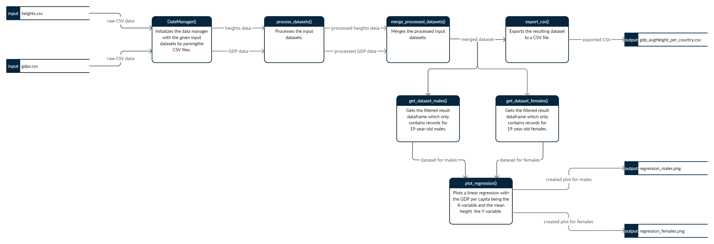

# Analysis of Correlation Between GDP per Capita and Average Height of Young Adults in 2019 in 164 Countries

## Abstract
The aim of this experiment is to find out whether there is a (strong) correlation between the
gross domestic product (GDP) per capita of a country and the average height of its 19-year-old
inhabitants. For this purpose, data from two publicly available datasets were used: One dataset
concerns the GDP per capita and the other contains data about the mean height of girls and boys of
different ages per country. Both datasets consist of data collected over the course of several years;
the year of interest for this experiment is 2019. The data entries from the two datasets were matched
by comparing the country name given in the respective entry. Only countries are taken into consideration 
for which both datasets yield complete information - in total, 164 countries were considered in the
experiment.

## Input Datasets
### GDP per Capita
The World Bank, GDP per capita (current US$), Washington, DC: The World Bank, 2021. Accessed on:
Apr. 13, 2021. [Online] Available: [https://data.worldbank.org/indicator/NY.GDP.PCAP.CD](https://data.worldbank.org/indicator/NY.GDP.PCAP.CD).

### Average Height
NCD Risk Factor Collaboration, Height - Evolution of adult height over time, NCD Risk Factor Collaboration, 2021.
Accessed on: Apr. 18, 2021. [Online] Available: [https://ncdrisc.org/data-downloads-height.html](https://ncdrisc.org/data-downloads-height.html)
under "Country-specific data for all countries".

## Persistent Identifiers
| Content | DOI |
|---------|-----|
| source code | [](https://doi.org/10.5281/zenodo.4699933) |
| results | [](https://doi.org/10.5281/zenodo.4699901) |
| DMP | [](https://doi.org/10.5281/zenodo.4701118) |
|maDMP | [](https://doi.org/10.5281/zenodo.4701149) |

## Folder Structure
| Folder Name | Description                                                                                                                                                                                        |
|-------------|----------------------------------------------------------------------------------------------------------------------------------------------------------------------------------------------------|
| `data`       | This folder contains the input datasets. Note that the `gdps.csv` dataset has been stripped of the header (compared to the original dataset).                                                                                         |
| `docs`        | This folder contains all documentation of the experiment, i.e., generated documentation of the source code as well as XML files describing the metadata corresponding to the produced output data. |
| `out`         | This is the folder where the output data is saved when running the experiment.                                                                                                                     |
| `src`         | This folder contains the source code for the experiment. The `main` function is defined in the `main.py` file.                                                                                     |

## Data Flow
The data flow of the experiment is visualized in the following data flow diagram.


## Prerequisites
In order to run the experiment, a version of Python is required that is greater than or equal to 3.7.

## Running the Experiment
First, the required dependencies have to be installed by executing the following command from the root directory
(`gdp-height`):
```
python -m pip install -r requirements.txt
```

Then, the experiment can be run by running the following command from the root directory:
```
python src/main.py
```

If the experiment is run successfully, two diagrams showing the linear regressions are displayed.
Additionally, three output files are created in the `out` folder:

| File Name                     | Description                                                                                                                                  |
|-------------------------------|----------------------------------------------------------------------------------------------------------------------------------------------|
| `gdp_avgHeight_per_country.csv` | This is a CSV file containing the raw data that is produced by processing<br>and merging the two input datasets.                             |
| `regression_males.png`          | This is a PNG file displaying the plot of the linear regression between the GDP per capita<br>and the average height of 19-year-old males.   |
| `regression_females.png`        | This is a PNG file displaying the plot of the linear regression between the GDP per capita<br>and the average height of 19-year-old females. |


## Generating the Documentation
Make sure that the required dependencies are installed (this can be done as described above).

Then, you can generate the documentation by executing the following command from the `src` folder:
```
python -m pdoc --html --output-dir ../docs .
```

This command will generate HTML files in the `docs/src` directory which can be viewed in any Web browser.
In the browser, it is possible to navigate the documentation.

## Contributing
Pull requests are welcome. For major changes, please contact the author before starting with the implementation.

## License
MIT